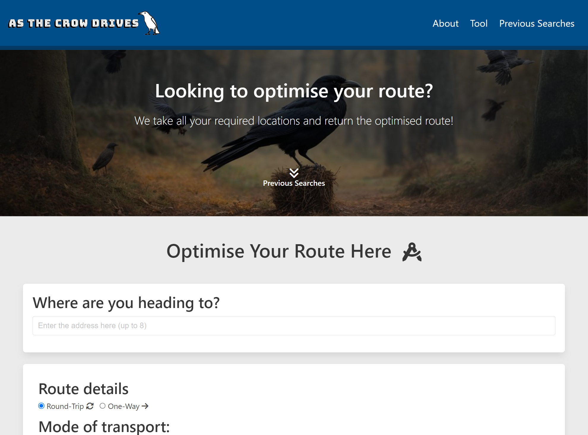
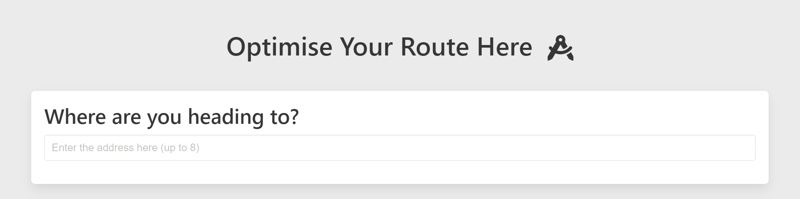
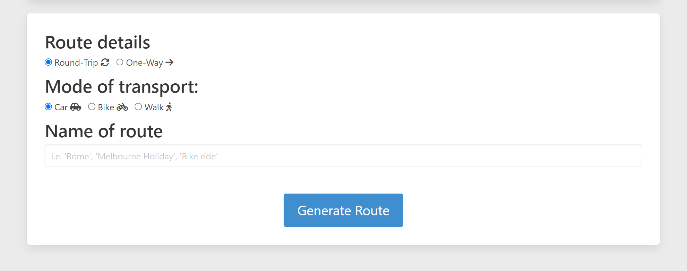
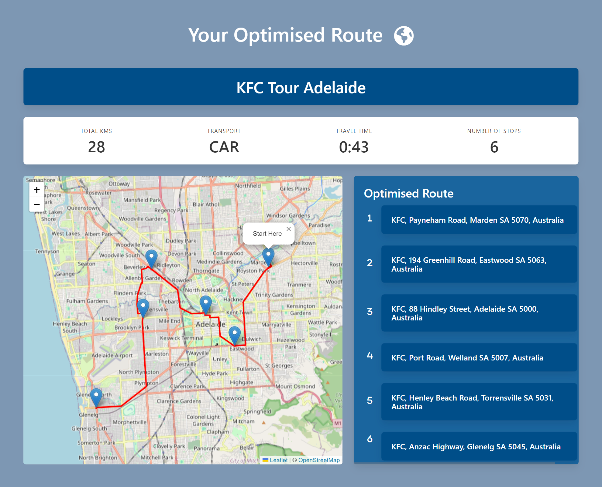
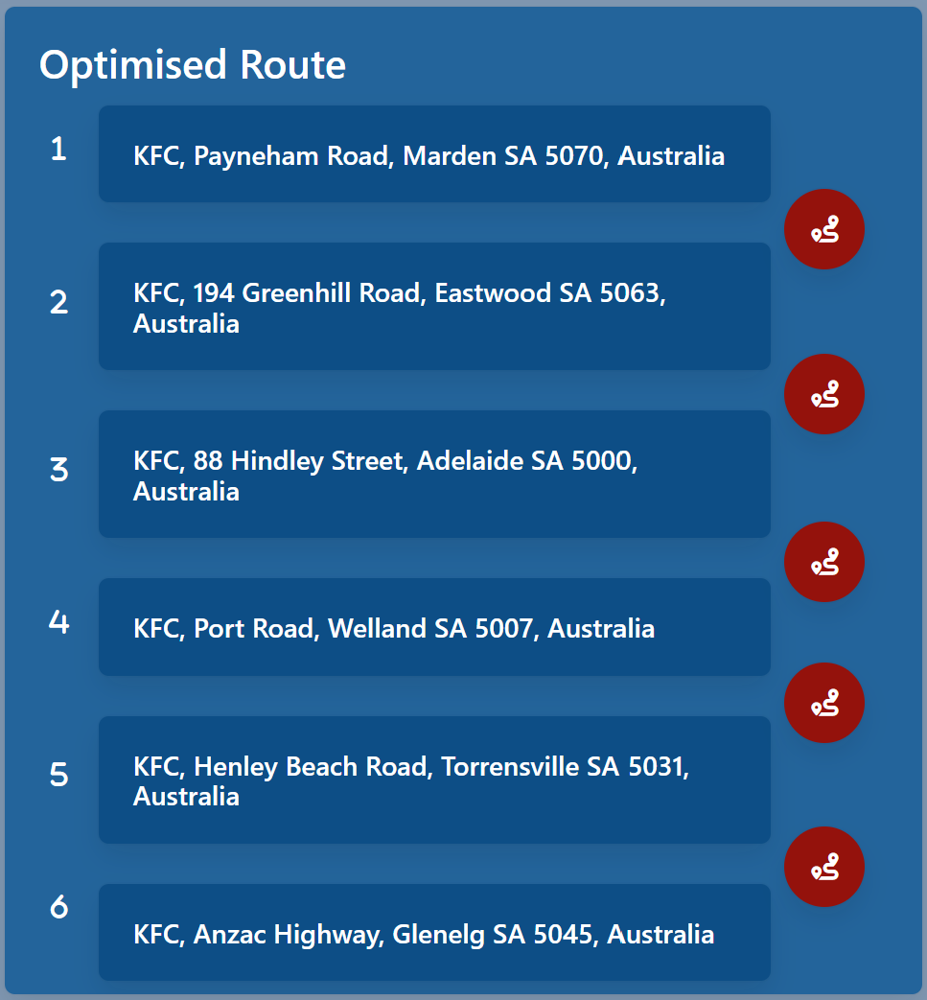
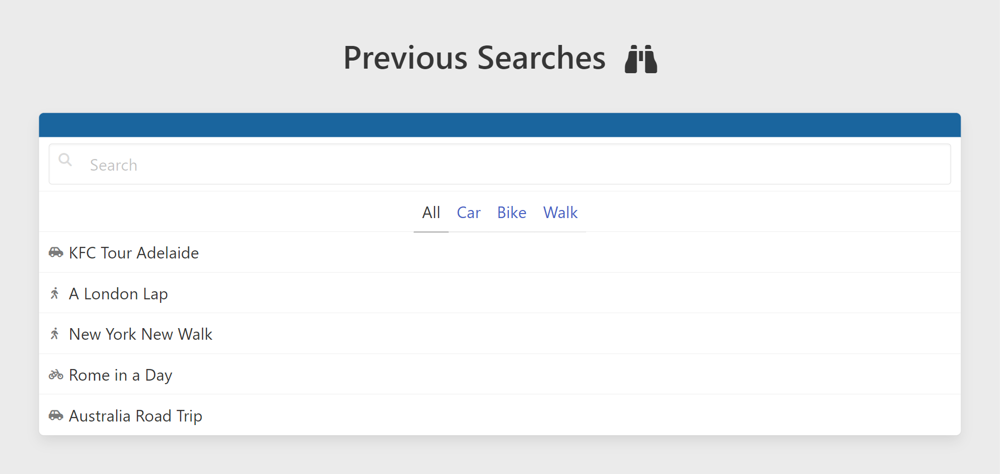
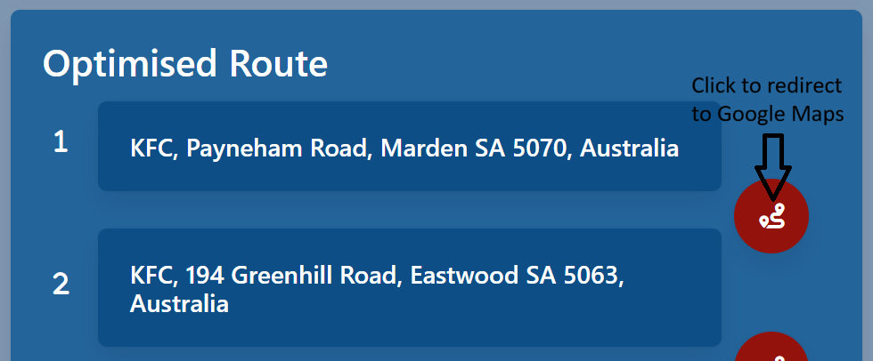
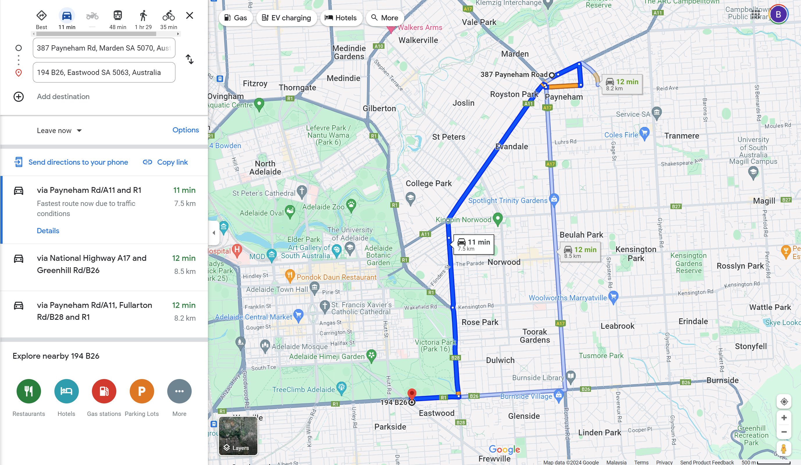

# AsTheCrowDrives

## Description

The following project was made as a part of the Adelaide University Web Development Bootcamp. This project has been inspired by real life problems. The inspiration came from the concept of community care Physiotherapy, where a Physiotherapist would need to visit 7-8 homes in the span of a day. The question is, given the starting point, what is the most efficient way to visit every home. A classic problem which resembles that of the Travelling Salesman problem. Our group set out to create a tool which resolved this issue, by using route optimisation APIs this tool allows you to find out the most efficient order to visit up to 8 routes. The tool has also been created with a range of features in mind regarding route specifics such as mode of transport and whether or not the route is a round-trip or one way trip.

This project was a valuable experience in handling 3rd-party APIs and mapping APIs. Through this project we were able to create complex API POST requests given requested locations and details from the user and handle the data provided back from the API. Using this data we experimented with Leaflet's maps API and dynamically created those maps with scale, markers and polylines. Overall this project has provided us with valuable experience in handling mapping and location based API's.

Please Note:
As of the 17th of February 2024, the free trial Graph Hopper API key will expire. This project will continue to provide the optimised route for up to 5 locations however will likely need an updated API key if you would like to trial longer distances yourself.

Live Link: https://klanger98.github.io/AsTheCrowDrives/

## Installation

Currently it is possible to follow the live link and use the app immediatly.

As of the 17th of February 2024, the free trial Graph Hopper API key will expire. This project will continue to provide the optimised route for up to 5 locations however will likely need an updated API key if you would like to trial longer distances yourself.

Feel free to sign up for GraphHopper here to receive a free API key to trial longer routes:
https://www.graphhopper.com/ 

## Usage

When loading the webpage you will be presented with the Tool page:

1. You can then scroll down to the input form where you can use the autocomplete input box to select up to 8 locations.

2. Once Selected, you can specifify details about your trip including whether or not it's a round trip and what mode of transport you will be using.

3. Then, once completed, pressing the 'Generate Route' Button will generate your optimised route and display it in the display area below as shown.

4. The display area will order every location from start to end as to what is most efficient way to visit every stop. Key Information about the trip is detailed including your chosen transport method, how long the trip will take (without stopping), how many Kilometers the trip is and how many stops will be taken.

5. At the bottom of the tool page you will also see a list of 'Previous Searches', this list will display 5 example routes by default and update with any of your searched routes as you begin to create them. Clicking on these previous searches will load them into the display area for you to study.

6. In the display area, you can click on the maps button found next to every suggested stop to redirect you to google maps so you can begin navigating. Don't forget to return back to find out which stop is the most effective to visit next!

## Credits

Our group members:

1. Badrul Borhanudin - https://github.com/BadrulBorhanudin
2. Karl Langer - https://github.com/KLanger98
3. Samantha Samarua - https://github.com/samanthasamarua

APIs used:

- GraphHopper - https://www.graphhopper.com/
  - Route Optimisation API - https://docs.graphhopper.com/#tag/Route-Optimization-API
- Leaflet - https://leafletjs.com/reference.html
- GeoAPIfy - https://www.geoapify.com/
  - Autocomplete API - https://www.geoapify.com/address-autocomplete

## Features

- Generate an optimised route based on up to 8 locations
- Search your locations using our autocomplete feature in the first input box
- Customise the route to be either one-way or a round-trip
- Choose your Mode of Transport to either be Car, Bike or Walking
- Give your generated route a name so you can save it effectively
- The Generate route button will generate an optimised route to be displayed on a map along with an ordered list of which locations to visit and in what order
- Look through your previous searches in the 'Previous Searches' list and select one to load into the display area
- Filter the previous searches by vehicle type
- Search the previous searches list by name
- Click on the navigate button next to a generated route to be provided with navigation between two points
